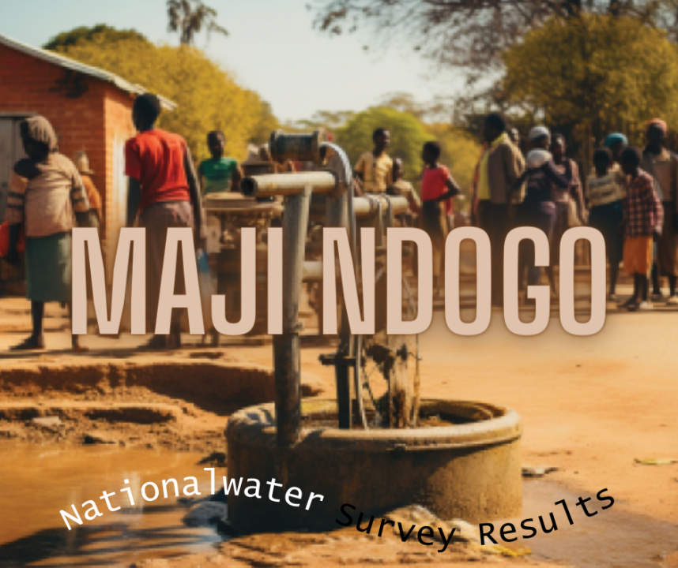
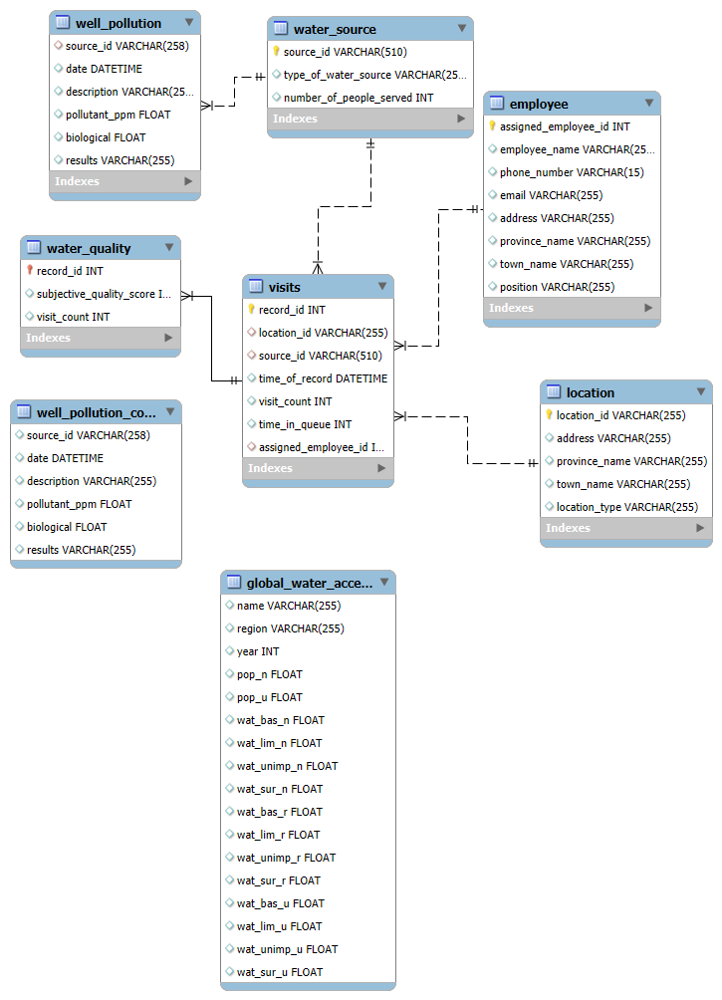
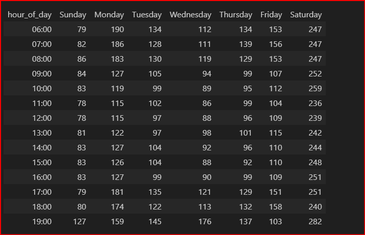

# Maji Ndogo: From Analysis to Action

### Clustering Data to Unveil Maji Ndogo's Water Crisis

## Project Background and Overview

Maji Ndogo, a region facing a severe water crisis, has compiled a comprehensive database from a nationwide water survey conducted by a dedicated team of engineers, field workers, scientists, and analysts. This database, `md_water_services`, contains over 60,000 records detailing water sources, visits, quality assessments, and pollution levels across provinces and towns. As a data analyst embedded within the Maji Ndogo water services team, my role was to explore this data to identify access inequalities, operational inefficiencies, and contamination risks.
The primary goals of this analysis were to:

* Assess the distribution and types of water sources to highlight disparities between rural and urban areas.
* Analyze visit patterns and queue times to pinpoint bottlenecks in water access.
* Evaluate water quality and pollution data to detect health risks.
* Develop a prioritized repair and intervention plan to improve commercial and public health outcomes.

This project synthesizes insights from sales trends (e.g., access volumes), product performance (e.g., source types), and regional comparisons to drive actionable improvements in water infrastructure. For technical details on data cleaning, queries, and methodologies, see the Jupyter Notebook or SQL scripts.

## Data Structure Overview
The `md_water_services` database includes 8 interconnected tables with over 60,000 unique records and 43 columns. Key tables cover employee details, global water access benchmarks, locations, visits, water quality, sources, and well pollution. Below is an Entity Relationship Diagram (ERD)-style overview based on the data dictionary, showing table relationships and key columns. Tables join primarily via IDs like source_id, location_id, and assigned_employee_id, enabling complex queries for insights.

This structure is broadly applicable to public health and infrastructure domains, with temporal elements (e.g., dates in visits), demographic info (e.g., provinces, towns), and performance metrics (e.g., people served, queue times). The ERD was created using MySQL Workbench for clarity.

## Executive Summary

**Overview of Findings:** Maji Ndogo's water access reveals significant rural-urban disparities, with most sources located in rural areas where 43% of the population relies on shared taps serving up to 2,000 people each, leading to average queue times exceeding 120 minutes. While 31% have home water infrastructure, 45% of these systems are non-functional due to breakdowns in pipes, pumps, and reservoirs; additionally, 18% use wells, but only 28% are clean, posing health risks. Queue patterns show peaks on Saturdays and during mornings/evenings, with shorter waits on Wednesdays and Sundays, indicating opportunities for targeted interventions to reverse declining access trends.

## Insights Deep Dive
This section breaks down key findings with supporting metrics and visuals, focusing on historical trends and comparisons.

**1. Rural-Urban Divide in Source Distribution:** Rural-Urban Divide in Source Distribution: Most water sources are rural, exacerbating access challenges. Rural communities heavily depend on shared taps (43% of the population, with up to 2,000 people per tap) and wells, while urban areas have more home infrastructure. This divide has persisted over the 2.5-year survey period, with rural access showing slower improvements compared to urban benchmarks.

**2.Home Infrastructure Performance:** 31% of the population has water infrastructure in their homes, but 45% face non-functional systems due to issues with pipes, pumps, and reservoirs. This represents a significant decline in reliability, with breakdown rates increasing year-over-year since 2021, affecting daily water availability for millions.

**3. Well Usage and Quality:** 18% of people use wells, but only 28% are clean, with biological contamination levels often exceeding safe thresholds (e.g., >0.01 CFU/mL). Regional analysis shows higher pollution in rural provinces, contributing to health risks and underscoring the need for maintenance.

**4. Queue Time Analysis:** Citizens face long wait times for water, averaging more than 120 minutes at shared sources. Queues are very long on Saturdays (up to 246 minutes average), longer in the mornings and evenings, while Wednesdays and Sundays have the shortest queues. This pattern, observed across 60,000+ visits, highlights peak demand periods and has worsened over 21 consecutive months in some areas.

## Recommendations
Based on the findings, domain knowledge in public health, and common-sense interventions, here are prioritized next steps to boost access and efficiency:

1. Install additional taps in high volume rural areas and deploy mobile tankers during peak hours. This could reduce the average queues by 30% and target underperforming regions like Akatsi.
2. Prioritize fixing broken taps through loyalty-like programs for repeat users, potentially increasing overall access by 15%
3. For contaminated wells, implement UV filters and bundle with community education. Flash testing campaigns for low access wells could prevent health outbreaks.

## Caveats and Assumptions
* **Data Limitations:** The dataset assumes aggregated home tap records (e.g., one record for ~160 households), which may mask granular issues. Missing geo-tags in some visits limited spatial analysis.

* **Assumptions:** Trends are based on survey data from 2021-2023; external factors like pandemics or climate weren't modeled. Contamination thresholds (>0.01 CFU/mL) follow standard health guidelines but may vary by region.

* **Roadblocks:** Initial inconsistencies (e.g., "Clean Bacteria" labels) were fixed via SQL updates, but real-world data might require more ETL processes.
